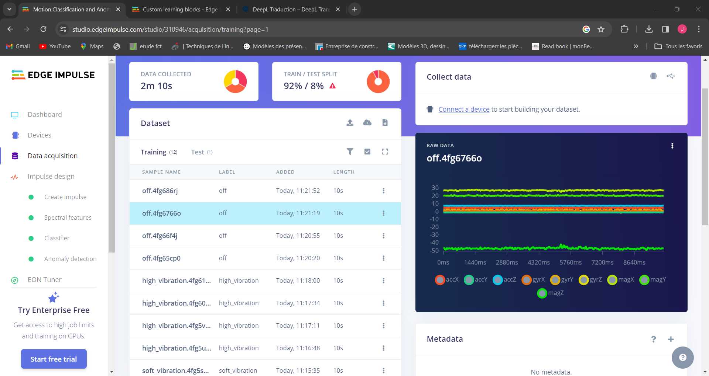
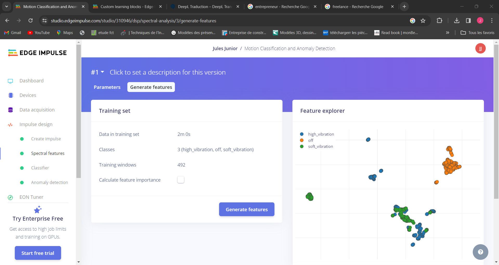
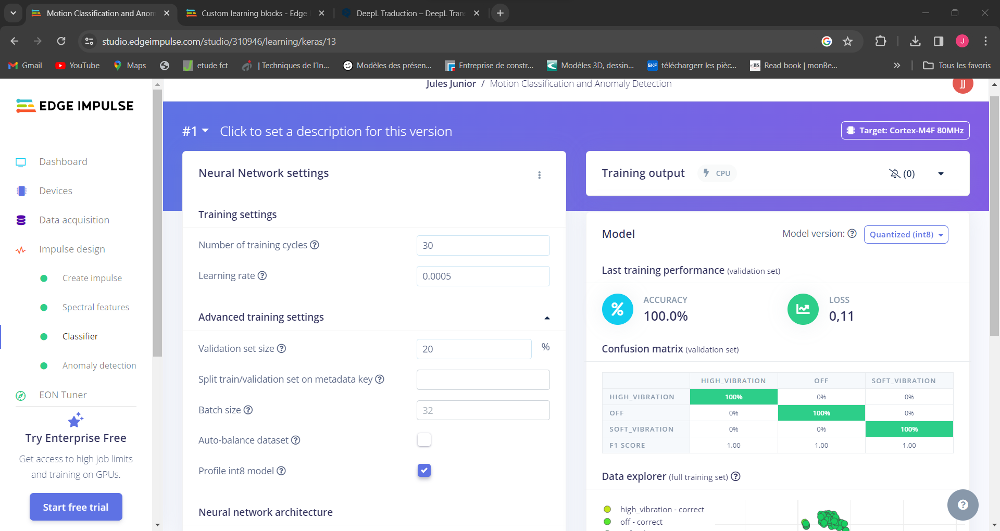
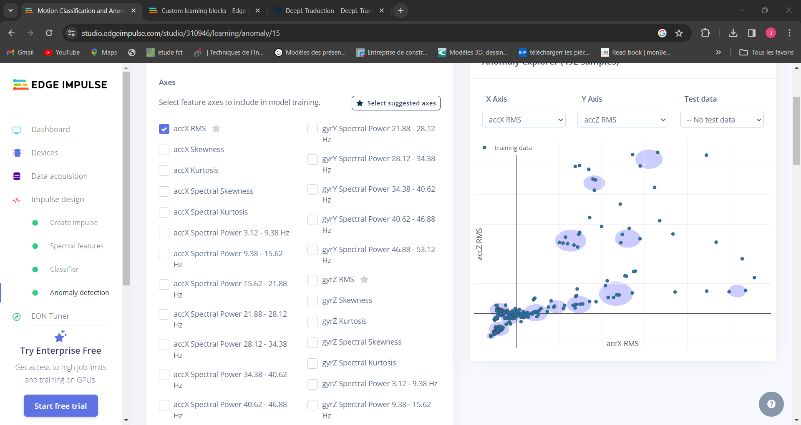
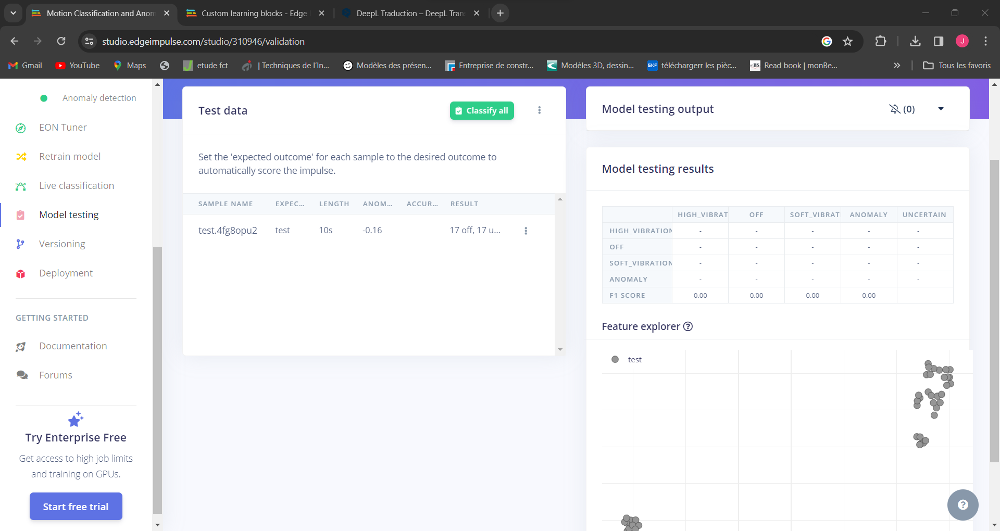

# Project_Motion_Classification_and-Anomaly_Detection
## DEscription

      

## 1e étape: Data Collection
Pour mon Projet j'ai choisi 03 modes :
  * soft_vibration
  * high vibration (vibration très élevé)
  * off (pas de vibration)

## 2e étape: Create Impulse
## 3e étape: Extract Features

## 4e étape: Entrainement du modèle

* 
* 
* 

## 4e étape: Model Testing
  
